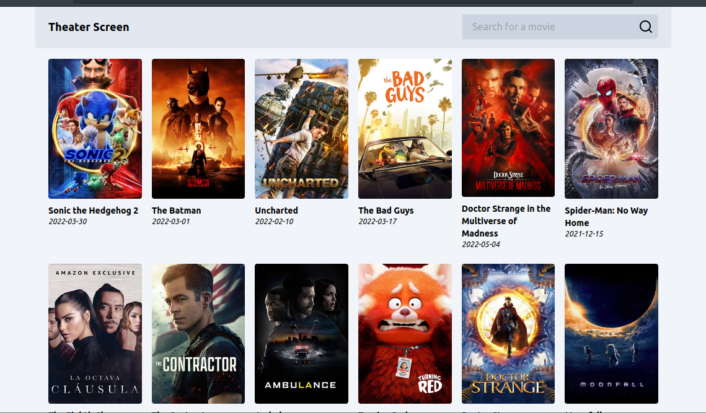

# Theater Screen

A small website to display movies and some info about each movie. A search functionality is also available.

- Live Site URL: [live site](https://theaterscreen.netlify.app/)

## Table of contents

- [Overview](#overview)
  - [The challenge](#the-challenge)
  - [Screenshot](#screenshot)
  - [Links](#links)
- [My process](#my-process)
  - [Built with](#built-with)
  - [Useful resources](#useful-resources)

## Overview

### The challenge

Users should be able to:

- See most popular movies at the start
- Search for a movie using an `input` field
- Filter movies by category
- Click on a movie title to see more detailed information on a separate page

### Screenshot

## My process

### Built with

- Semantic HTML5 markup
- [TailwindCSS](https://tailwindcss.com) - CSS Framework
- [Sveltekit](https://kit.svelte.dev/) - JS Framework

### Useful resources

- [TailwindCSS](https://tailwindcss.com) - This helped me for designing and styling the website as easy as possible.
